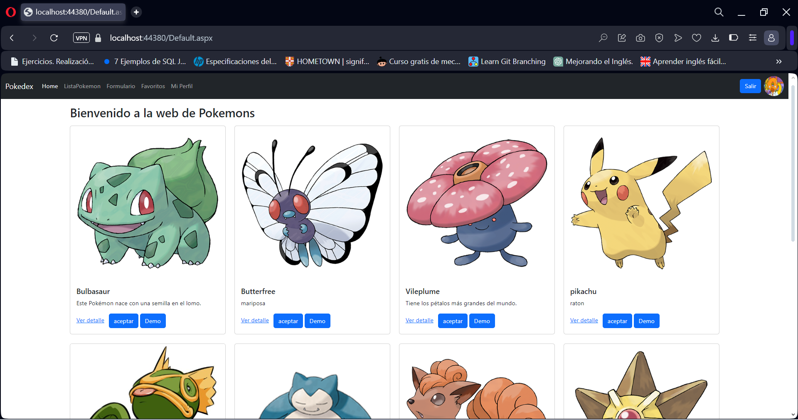
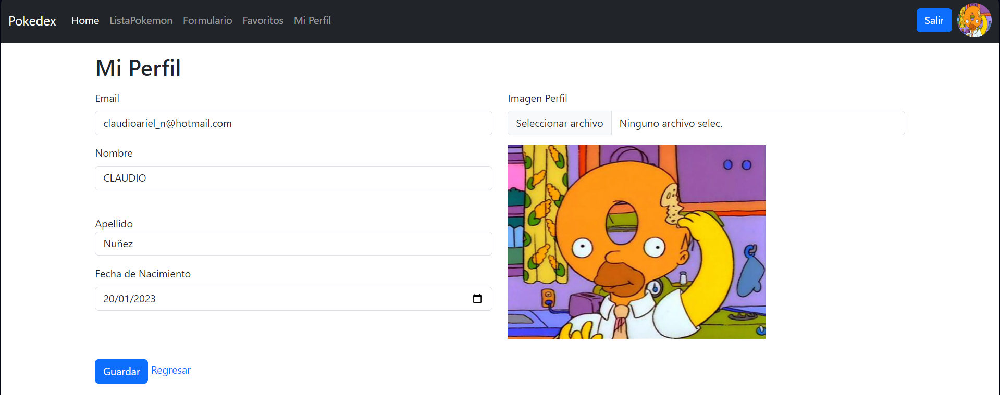

##  Pokemon_WebApp - Curso C# Nivel 3

 Se trata de un proyecto web hecho en lenguaje C#, realizado en el curso de Maxiprograma, esta administra un listado de pokemons.
 
 Los usuarios pueden realizar las tareas básicas de un CRUD (leer, modificar, crear y eliminar registros).
 
 El motor de base de datos utilizado es Microsoft SQL Server.
 
 Posee validaciones y restricciones varias como así también un sistema de login, con validaciones de email, fechas, etc.
 
Permite realizar filtrados desde la misma aplicación y también haciendo llamados a la base de datos.

### Tecnologías utilizadas:
 - Se utilizó Programación Orientada a Objetos.
 - NET Framework 4.8
 -  SQL Server
 - ADO.NET
 - ASP.Net Framework
   

